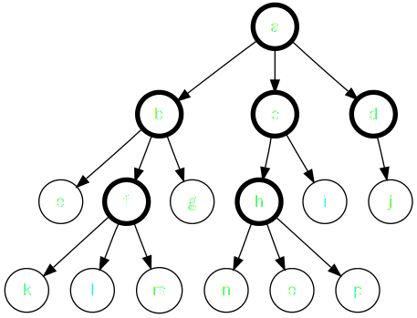

Dynamic Programming

*algospot winter camp 2011*

---

# 동적 계획법

* Dynamic 하고도, Programming 하고도 아무 관련 없는 알고리즘 설계 패러다임
    * 전산학의 역사 사상 제일 잘못 지은 이름이라고 생각합니다
* 한 마디로 말하자면: 문제를 여러 조각들로 나누고, 이 때 여러 번 계산되는 문제들을 메모리에 저장해서 속도를 올린다
* 프로그래밍 대회에서는 참 중요하죠

---

# 무슨 이야기를 할까요

* 재귀 호출: 문제를 여러 조각으로 쪼개 재귀적으로 해결하는 방법
* 완전 탐색: 재귀 호출을 이용해 최적화 문제 풀기
* 메모이제이션: 시간과 공간 트레이드오프로 동적 계획법 알고리즘 만들기
* 최적화 문제의 실제 최적해 찾기
* 경우의 수 세기와 확률 문제 DP 로 풀기
* 다른 테크닉들 (시간이 되면..)

---

# 재귀 호출이 뭐냐면

* 다 아시는 얘길테지만 한 번 하고 넘어갑시다

* 컴퓨터가 하는 많은 일들은 작은 조각들로 쪼갤 수 있죠
* 문자열 길이 재기: 첫 글자 세고,
두 번째 글자 세고, 세 번째 글자 세고..
* 정렬: 제일 작은 원소 찾고, 두 번째로 작은
원소 찾고, 세 번째로 작은 원소 찾고..
* _재귀 호출 함수_: 하나의 큰 작업을 유사한 형태의 여러 _조각_으로 쪼갠 뒤, 그 중 한 조각을 수행하고, 나머지를 자기 자신을 호출해 실행하는 함수

---

# 예를 들어 봅시다

	!cpp
	// 필수 조건: n >= 1
	// 1 부터 n 까지의 자연수의 합을 반환한다
	int sum(int n) {
	  int ret = 0;
	  for(int i = 1; i <= n; ++i)
	  	ret += i;
	  return ret;
	}

* 각 숫자를 한 개의 _조각_이라고 하면, $n$ 개의 조각으로 쪼갤 수 있지요
* 재귀 호출 함수는 한 개의 조각을 수행하고, 나머지를 재귀호출해서 해결합니다

---

# 아이구 그건 쉽지

	!cpp
	int recursiveSum(int n) {
	  if(n == 1) return 1; // 더 못 쪼개겠네
	  return n + recursiveSum(n-1);
	}

* $sum(n)=n+sum(n-1)$ 을 이용하면 되니까
* _기저 사례_ (base case): 첫 줄에 있는 `if` 문. 더 이상 쪼개지지 않는 최소의 입력을 처리하죠

---

# 기저 사례 고르기

	!cpp
	int wrongSum(int n) {
	  if(n == 2) return 3; // 1+2
	  return n + wrongSum(n-1);
	}

	int correctSum(int n) {
	  if(n == 0) return 0;
	  return n + correctSum(n-1);
	}

	int correctSum2(int n) {
	  if(n == 0) return 0;
	  if(n == 1) return 1;
	  if(n == 2) return 3;
	  return n + correctSum2(n-1);
	}

---

# 중첩 `for` 대체하기

	!cpp
	for(int i = 0; i < n; ++i)
	  for(int j = i+1; j < n; ++j)
	  	for(int k = j+1; k < n; ++k)
	  		cout << i << " " << j << " " << k << endl;

* $n$ 개의 원소 중에서 3개를 고르는 모든 방법
* 4개를 해야 하면 어쩌지? 4중 `for`문을 쓰나?
* 5개를 해야 하면 어쩌지? 5중 `for`문을 쓰나?

---

# 재귀호출로 바꾸긔

* 이 코드 조각이 하는 작업을 3개로 나누자
    * 한 조각에서 한 개의 원소 고르기
* 한 개 골랐으면 나머지는 재귀호출해서 자기한테 떠넘기자
* 재귀호출할 때 어떤 정보를 넘겨줘야 할까?
    * 원소들의 총 개수
    * 더 골라야 할 원소들의 개수
    * 지금까지 고른 원소들의 번호

---

# 재귀호출로 바뀐 코드

    !cpp
    // n: 전체 원소의 수
    // picked: 지금까지 고른 원소들의 번호
    // toPick: 더 고를 원소의 수
    // 일 때, 앞으로 toPick 개의 원소를 고르는 모든 방법을 출력한다.
    void pick(int n, vector<int>& picked, int toPick) {
        // 기저 사례: 더 고를 원소가 없을 때 고른 원소들을 출력한다
        if(toPick == 0) {
            printPicked(picked);
            return;
        }

        // 고를 수 있는 가장 작은 번호를 계산한다
        int smallest = picked.empty() ? 0 : picked.back() + 1;
        // 이 단계에서 원소 하나를 고른다
        for(int next = smallest; next < n; ++next) {
            picked.push_back(next);
            pick(elements, picked, toPick - 1);
            picked.pop_back();
        }
    }

---

# 재귀호출과 부분 문제

* 문제 (problem) 과 부분 문제 (subproblem)
* 어느 쪽이 재귀호출에서 얘기하는 '문제'일까?
    * <s>입력으로 주어지는 자연수 수열을 정렬하라.</s>
    * ${16,7,9,1,31}$ 을 정렬하라.
* _문제_ 란 수행해야 할 작업과 작업을 적용할 자료의 조합
* _부분 문제_ 란 문제를 구성하는 조각 중 하나를 떼어내고 남은 문제

---

# 최적화 문제 (optimization problem)

* 문제의 답이 여러 개 있고 그 중 가장 좋은 답을 찾는 문제
    * 우리집에서 구글코리아 오피스까지 오는 제일 _짧은_ 경로는?
    * 오늘 사온 간식을 다 같이 나눠먹되 내가 제일 _많이 먹는_ 방법은?
* 최적화 문제를 푸는 방법은 다양하지만 그 중 제일 기본적인 방법은 *무식하게* 푸는 것입니다

---

# 완전 탐색 (exhaustive search)

* 답이 여러 개 있어서 어느 게 더 좋은지 모르겠다고? 그럼 다 만들어 보지 뭐
* 컴퓨터가 잘하는게 계산 빠른 것밖에 더 없으니 유용합니다
* 재귀호출로 구현하는게 제일 쫄깃하지요

---

# 관광 코스 정하기

 

* 네 군데 중 세 군데를 방문하고 싶어요
* 관광지 사이에 이동하는 시간이 서로 다릅니다
* 어느 관광지를 어느 순서대로 방문해야 제일 빨리 돌아볼 수 있을까요?

---

# 모든 경로를 다 만들어 보지 뭐!

    !cpp
    int n; // 도시의 수
    int distance[10][10]; // 두 도시간의 거리를 저장하는 배열

    // 주어진 경로의 길이를 반환하는 함수
    int getPathLength(const vector<int>& path);
    // 주어진 경로에 해당 도시가 이미 포함되어 있는지를 반환하는 함수
    bool isVisited(const vector<int>& path, int city);

    // curPath: 지금까지 만든 경로 위에 있는 도시들의 번호
    // toVisit: 앞으로 더 방문해야 하는 도시의 개수
    // 라고 할 때, 만들 수 있는 경로 중 가장 짧은 것을 출력한다
    int shortestPath(vector<int>& curPath, int toVisit) {
        // 기저 사례: 이미 경로가 완성되었을 때 현재 길이를 반환
        if(toVisit == 0) return getPathLength(curPath);
        int ret = 987654321;
        for(int next = 0; next < n; ++next) {
            if(isVisited(curPath, next)) continue;
            curPath.push_back(next);
            ret = min(ret, shortestPath(curPath, toVisit - 1));
            curPath.pop_back();
        }
    }

---

# 완전 탐색으로 다 되지 않는 세상

 | 
----|----

한 부분 문제는 한 번만 해결됨
|
한 부분 문제가 여러 번 중복으로 해결됨

* 이런 현상을 *중복되는 부분 문제* (overlapping subproblems) 라고 부릅니다

---

# 이항 계수 (binomail coefficient)

\\[
\\left({n\\atop r}\\right)=\\begin{cases}
\\left({n-1\\atop r-1}\\right)+\\left({n-1\\atop r}\\right)\\\\
1 & (r=0\\mbox{ or }n=r)\\end{cases}\\]

구현하는 건 간단하죠?

    !cpp
    int bino(int n, int r) {
        // 기저 사례: n=r or r=0
        if(r == 0 || n == r) return 1;
        return bino(n-1, r-1) + bino(n-1, r);
    }

---

# 아니 이게 무슨 소리야

* `bino(25,12)` 를 계산하려면 1천만번의 함수 호출이 필요하다고?
* 의사양반 내 코드가 ㄱㅈ란 말이요

---

# 시간-공간 트레이드오프

    !cpp
    int cache[100][100];
    int bino(int n, int r) {
        if(n == r || r == 0) return 1;
        int& ret = cache[n][r];
        if(ret != -1) return ret;
        return ret = bino(n-1, r-1) + bino(n-1, r);
    }
    ..
    memset(cache, -1, sizeof(cache));

* 함수의 반환값을 저장해 둘 캐시를 만들어 놓자
* 한 번 계산한 값은 캐시에 저장해 두고
* 함수가 호출될 때마다 저장된 적이 있는지 캐시에 확인하기
* 간단하죠? 이런 기법을 메모이제이션 (memoization) 이라고 부릅니다

---

# 메모이제이션을 언제 쓸 수 있나?

    !cpp
    int counter = 0;
    int count() {
        return counter++;
    }

* 이런 함수에 쓰는 바보짓을 할 순 없죠..
* 전역 변수, 클래스의 멤버 변수, 파일 입력, 키보드 입력에 영향받는 함수는 안된다
* 함수 반환값이 항상 함수의 입력에 의해서만 계산되는 함수
* 멋있게는 참조적 투명한 (referential transparent) 함수에만 써먹을 수 있죠

---

# 메모이제이션의 시간 복잡도 분석

## (부분 문제의 수)$\\times$(부분 문제 하나당 반복문 실행 회수)

## = (굵은 원의 수)$\\times$(굵은 원 하나당 나가는 화살표의 수)

---

# 삼각형 위의 최대 경로 찾기

<pre style="font-size: 35px;"><code>6
1 2
3 7 4
9 4 1 7
2 7 5 9 4</code></pre>

* 맨 위의 숫자에서 시작해 한 칸씩 아래로 내려가기
* 왼쪽이나 오른쪽 숫자로 내려갈 수 있음
* 경로에서 만나는 숫자의 최대 합은 얼마일까?

---

# 무식하게 메모이제이션 적용하기

    !cpp
    // MAX_NUMBER: 한 칸에 들어갈 숫자의 최대값
    int n, triangle[100][100];
    int cache[100][100][MAX_NUMBER*100+1];

    // (y,x) 위치까지 내려오기 전에 만난 숫자들의 합이 sum 일 때
    // 맨 아래줄까지 내려가면서 얻을 수 있는 최대 경로를 반환한다
    int path1(int y, int x, int sum) {
        // 기저 사례: 맨 아래 줄까지 도달했을 경우
        if(y == n-1) return sum + triangle[y][x];

        // 메모이제이션
        int& ret = cache[y][x][sum];
        if(ret != -1) return ret;

        sum += triangle[y][x];
        return ret = max(path1(y+1, x+1, sum), path1(y+1, x, sum));
    }

---

# 아니 의사선생 내코드가 ㄱㅈ란 말이요

<pre style="font-size: 35px;"><code>1
2 4
8 16 32
64 128 256 512
1024 2048 4096 8192 16384</code></pre>

* 모든 경로는 서로 합이 다르다!
* 두 부분 문제가 겹칠 일이 없어요

---

# 최적 부분 구조가 구해줄거야

* `path1()` 의 입력 $y$, $x$, $sum$ 은 두 부류로 나눌 수 있다
    * $y$, $x$: 부분 문제의 정의 = 앞으로 풀어야 할 조각들
    * $sum$: 지금까지 해결한 조각들의 결과
* 이 때 *$(y,x)$ 에서 내려가는 최대 경로* 랑 $sum$ 이랑은 상관이 없어요
* 지금까지 어떤 경로로 내려왔건간에 `path1()` 는 $(y,x)$ 에서 내려가는 최대 경로만 찾거든요

---

# 최적 부분 구조

* _문제와 분할 방식이 가지는 성질_
* 부분 문제의 최적해만 갖고 있으면 전체 문제의 최적해를 구성해낼 수 있다
    * 다르게 말해, 부분 문제는 항상 최적해만 구하면 된다!
* 성립하지 않는 예:
    * 맨 윗줄에서 아랫줄까지 내려오면서 같은 숫자를 두번 만나면 안된다
    * 이 위에서 어떤 수를 만났느냐에 따라 다른 답을 반환해야 할 수도 있다!

---

# 문제 정의 바꾸기

* `path1(y,x,sum)`: $(y,x)$ 까지 내려오는 경로의 합이 $sum$ 이었을 때 전체 경로의 최대 합
* `path2(y,x)`: $(y,x)$ 에서 맨 아래까지 내려가는 경로 중 최대 합

